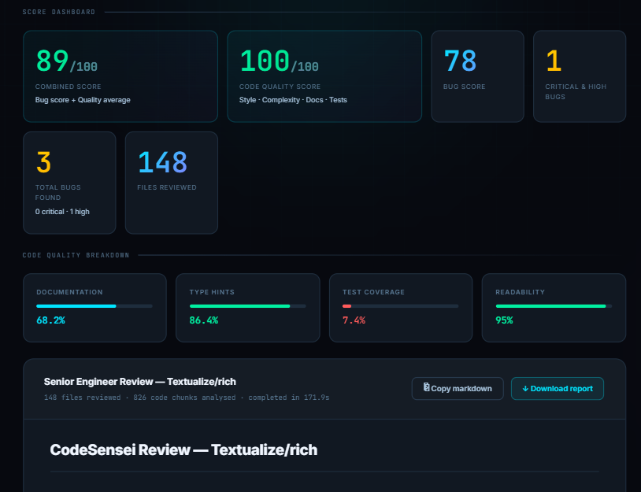
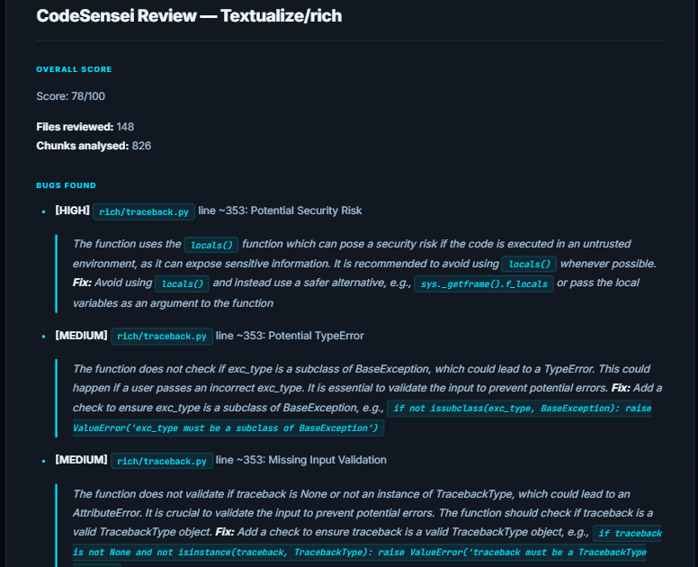
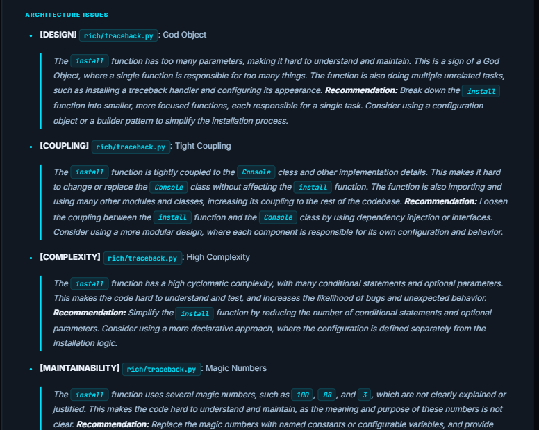

<div align="center">


# CodeSensei

**Multi-agent AI code review system that analyzes entire GitHub repositories using RAG, semantic retrieval, and LLM reasoning to detect bugs, architectural issues, security risks, and code quality metrics with precise file-level recommendations.**

[](https://python.org)
[](https://fastapi.tiangolo.com)
[](https://langchain-ai.github.io/langgraph)
[](https://trychroma.com)
[](https://groq.com)
[](LICENSE)

[Quick Start](#quick-start) · [How It Works](#how-it-works) · [Architecture](#architecture) · [API](#api-reference) · [Tech Stack](#tech-stack)

</div>

---

<div align="center">

| Purpose | Technology |
| ------- | ---------- |
| 🤖 AI Agents | 5 Autonomous LangGraph Agents |
| 🌐 Languages Supported | 12+ (Python, JS, TS, Go, Rust, and more) |
| 🗄️ Vector Database | ChromaDB |
| 🧠 Embedding Model | sentence-transformers (HuggingFace) |
| 💬 LLM | Groq · Llama 3 70B |
| ⚡ Backend | FastAPI (async) |

</div>

---

## 🎥 Demo

<!-- Replace with actual GIF once recorded -->
<!--  -->

```
GitHub Repository URL
        │
        ▼
  Live Progress Bar
        │
        ▼
  Score Dashboard
        │
        ▼
  Bug Detection Report
        │
        ▼
  Architecture Analysis
        │
        ▼
  Markdown Engineering Report
```

> **Coming Soon** — a 20–30 second walkthrough showing repository submission, live progress, dashboard generation, bug detection, architecture analysis, and report download.

---

<div align="center">



<sub>CodeSensei analyzing <code>Textualize/rich</code> — 148 files · 826 semantic code chunks · 171.9 s processing time · 5 AI agents</sub>

</div>

<div align="center">



<sub>Bug detection on <code>Textualize/rich</code> — each finding includes severity, file path, line number, and a concrete suggested fix.</sub>

</div>

<div align="center">



<sub>Architecture analysis on <code>Textualize/rich</code> — design, coupling, complexity, and maintainability issues, each with a concrete recommendation.</sub>

</div>

---

## ✨ Key Features

- 🤖 **Multi-Agent Pipeline** — 5 autonomous AI agents orchestrated using LangGraph
- 🔍 **Semantic Retrieval** — repository-wide code search with RAG and ChromaDB
- 🐞 **Bug Detection** — severity, file paths, and exact line numbers
- 🔒 **Security Analysis** — potential issue identification with AI-generated recommendations
- 🏗️ **Architecture Analysis** — detects God Objects, tight coupling, cyclomatic complexity, and missing abstractions
- 📊 **Code Metrics** — documentation, type hints, test ratios, and readability scores
- ⚡ **FastAPI Backend** — async REST API with background job processing
- 📝 **Engineering Reports** — detailed Markdown reports with actionable insights

---

## 🏆 Key Innovations

✓ Multi-Agent Review — no single prompt, no context ceiling  
✓ Repository-wide RAG — the full codebase is embedded and queried semantically  
✓ Semantic Code Retrieval — only the most relevant chunks go to the LLM  
✓ Structured Engineering Reports — typed output objects with severity, file, line, fix  
✓ Context-aware Bug Detection — finds bugs the LLM would miss in isolation  
✓ Architecture Scoring — quantified structural health, not just subjective commentary  
✓ Automated Quality Metrics — docstring coverage, type hints, test ratios, readability  

---

## ❓ Why Not Just ChatGPT?

Traditional LLMs struggle with repositories because their context windows cap out at a few thousand tokens — far too small for a real production codebase.

CodeSensei solves this with **Retrieval-Augmented Generation (RAG)**. The entire repository is embedded into a vector store. Each agent then semantically queries only the chunks relevant to its task — bugs, architecture, quality — so the LLM never sees more than ~1,500 tokens at a time, but the full codebase is covered.

Result: repository-scale review without hitting any context limit.

---

## Sample Output

Results below were produced against real, widely-used Python repositories. Numbers are reproducible — point the tool at the same repos and you should see comparable scores.

| Repository | Stars | Score | Critical / High Bugs | Notable Finding |
| ---------- | ----- | ----- | -------------------- | --------------- |
| `pallets/flask` | 67k | 27/100 | 5 | Monolithic structure, tight coupling between core modules |
| `Textualize/rich` | 56k | 78/100 | 1 | Potential security-related finding in `rich/traceback.py` (line ~353) |
| `psf/requests` | 52k | 100/100 | 0 | High readability, strong type coverage, minimal architectural debt |

---

## ⚡ Performance

| Metric | Value |
| ------ | ----- |
| Repository Size | 148 files |
| Code Chunks Generated | 826 |
| Embedding Time | ~45 s |
| Full Review Time | 171.9 s |
| AI Agents | 5 |
| Average Chunks per Query | ~15 |
| Max Tokens per LLM Call | ~1,500 |

---

## Use Cases

- **Pre-merge code review** — surface risky changes before they hit `main`.
- **Onboarding** — give new engineers a fast structural map of an unfamiliar codebase.
- **Open-source audits** — assess the architectural health of any public dependency.
- **Engineering portfolios** — generate an objective quality report for repos you maintain.

---

## How It Works

```
                       GitHub Repository URL
                                │
                                ▼
                    ┌─────────────────────────┐
                    │   Repository Ingestion   │
                    │  GitHub API + AST Parser │
                    └────────────┬────────────┘
                                 │
                    ┌────────────▼────────────┐
                    │    Embedding Generation  │
                    │  HuggingFace Transformers│
                    └────────────┬────────────┘
                                 │
                    ┌────────────▼────────────┐
                    │   ChromaDB Vector Store  │
                    │  Semantic Code Retrieval │
                    └────────────┬────────────┘
                                 │
              ┌──────────────────▼──────────────────┐
              │       LangGraph Multi-Agent Pipeline  │
              │                                       │
              │  ┌─────────────┐  ┌───────────────┐  │
              │  │ Bug Hunter  │  │  Architecture  │  │
              │  │   Agent     │  │     Agent      │  │
              │  └─────────────┘  └───────────────┘  │
              │                                       │
              │         ┌─────────────────┐           │
              │         │  Code Quality   │           │
              │         │     Agent       │           │
              │         └─────────────────┘           │
              └──────────────────┬──────────────────┘
                                 │
                    ┌────────────▼────────────┐
                    │      Report Agent        │
                    │  Groq · Llama 3 70B      │
                    └────────────┬────────────┘
                                 │
                    ┌────────────▼────────────┐
                    │  Dashboard + Markdown    │
                    │  Report (Score /100)     │
                    └─────────────────────────┘
```

### Agents

| # | Agent | Responsibility | Stack |
| - | ----- | -------------- | ----- |
| 1 | 📥 **Repo Ingestion** | Fetch files via the GitHub API, chunk by function/class boundary, embed and persist to ChromaDB. | GitHub API · HuggingFace · ChromaDB |
| 2 | 🐞 **Bug Hunter** | Query the vector store for risky patterns; send candidate chunks to the LLM; extract structured bugs with severity and line numbers. | ChromaDB · LangChain · Groq |
| 3 | 🏗️ **Architecture** | Detect God Objects, tight coupling, high cyclomatic complexity, magic numbers, and missing abstractions. | ChromaDB · LangChain · Groq |
| 4 | 📊 **Code Quality** | Compute docstring coverage, type-hint coverage, test-to-source ratio, and a readability heuristic. | Python AST · Regex · Groq |
| 5 | 📝 **Report** | Synthesize all findings into a scored markdown report with an executive summary and concrete fixes. | Groq · LangGraph |

---

## Quick Start

### Requirements

- Python 3.11+
- A free [Groq API key](https://console.groq.com)
- A [GitHub personal access token](https://github.com/settings/tokens) with `public_repo` (read) scope

### 1. Clone

```bash
git clone https://github.com/NikhilPa/codesensei
cd codesensei/backend
```

### 2. Install

```bash
python -m venv venv
# Windows
venv\Scripts\activate
# macOS / Linux
# source venv/bin/activate

pip install torch --index-url https://download.pytorch.org/whl/cpu
pip install -r requirements.txt
```

### 3. Configure environment

```bash
cp .env.example .env
```

```env
GROQ_API_KEY=gsk_...
GITHUB_TOKEN=ghp_...
CHROMA_PERSIST_DIR=./chroma_db
MAX_FILES_PER_REPO=150
```

### 4. Run

```bash
uvicorn main:app --reload --port 8000
```

Open [http://localhost:8000](http://localhost:8000), paste a public GitHub URL, and start a review.

> A full review typically takes **60–180 seconds** depending on repo size. The UI polls `/api/status/{job_id}` every two seconds and updates the dashboard, bug list, and architecture report as soon as the job completes.

### Suggested repositories to try

| Repository | Why it's interesting |
| ---------- | -------------------- |
| `Textualize/rich` | Surfaces a real security-related finding in `traceback.py`. |
| `pallets/flask` | A widely-used library that scores lower than most people would expect. |
| `psf/requests` | A useful reference for what high-quality Python looks like under analysis. |
| *your own repo* | Probably the most useful one to point it at. |

---

## Architecture

```
📦 codesensei/
├── 📂 backend/
│   ├── main.py                     # FastAPI — REST API with background jobs
│   ├── 📂 agents/
│   │   ├── graph.py                # LangGraph StateGraph — orchestrates the 5 agents
│   │   ├── ingestion.py            # Agent 1 — GitHub fetch + embed pipeline
│   │   ├── bug_hunter.py           # Agent 2 — semantic bug detection
│   │   ├── architecture.py         # Agent 3 — structural analysis
│   │   ├── quality.py              # Agent 4 — code-quality scoring
│   │   └── report.py               # Agent 5 — report synthesis
│   ├── 📂 vectorstore/
│   │   ├── embed.py                # HuggingFace sentence embeddings
│   │   └── store.py                # ChromaDB read/write
│   ├── 📂 utils/
│   │   ├── github_fetcher.py       # GitHub REST API client
│   │   └── chunker.py              # AST-based code chunker
│   └── requirements.txt
├── 📂 frontend/
│   └── index.html                  # Single-file dark-theme UI
├── 📂 assets/
│   ├── dashboard.png
│   ├── bugs.png
│   └── architecture.png
└── README.md
```

### Design Decisions

**RAG over a single large prompt.** A production repository easily exceeds any current model's context window. ChromaDB lets each agent retrieve only the chunks relevant to its question (bugs, architecture, or quality) instead of attempting one giant prompt.

**Asynchronous job model.** A full review takes 60–180 seconds depending on repo size. `POST /api/review` returns a `job_id` immediately; the client polls `GET /api/status/{job_id}` until the job completes. This keeps the HTTP layer responsive and avoids gateway timeouts.

**LangGraph for orchestration.** Each agent reads and writes a typed `State` object. LangGraph handles conditional edges and per-node error handling, so a failure in one agent doesn't abort the entire review.

**Groq + Llama 3 70B as the default LLM.** Free tier, low latency, no local GPU required. The LLM client is isolated behind a thin wrapper, so swapping in OpenAI, Anthropic, or a self-hosted model is a one-file change.

---

## Tech Stack

| Purpose | Technology | Role |
| ------- | ---------- | ---- |
| Multi-Agent | LangGraph | Typed state machine, conditional edges, per-node errors |
| Vector DB | ChromaDB | Semantic retrieval over the embedded codebase |
| Embeddings | HuggingFace Transformers | Local sentence-transformer model, CPU-only |
| LLM | Groq · Llama 3 70B | Default review model; isolated behind a wrapper |
| LLM Framework | LangChain | Prompt templates and structured-output parsing |
| API | FastAPI | Async REST API with background tasks |
| Retrieval | RAG (ChromaDB + LangChain) | Context-aware chunk retrieval per agent |
| Parsing | Python AST | Function and class boundary detection for chunking |
| Source Access | GitHub REST API | File fetching from public repositories |
| Frontend | Vanilla HTML / CSS / JS | Single-page UI, no build step |

---

## Supported Languages

Python · JavaScript · TypeScript · Java · Go · C · C++ · C# · Ruby · PHP · Rust · Kotlin · Swift

> Bug-hunting and architecture analysis work best on Python today, since chunking uses the Python AST. Other languages currently fall back to regex-based chunking.

---

## API Reference

### Start a review

```http
POST /api/review
Content-Type: application/json

{
  "repo_url": "https://github.com/Textualize/rich"
}
```

```json
{
  "job_id": "abc-123-def",
  "message": "Review started. Poll /api/status/{job_id} for progress."
}
```

### Poll for results

```http
GET /api/status/{job_id}
```

```json
{
  "status": "complete",
  "result": {
    "score": 78,
    "quality_score": 100,
    "critical_count": 1,
    "bug_count": 3,
    "file_count": 148,
    "chunks_analysed": 826,
    "bugs": [ "..." ],
    "arch_issues": [ "..." ],
    "quality": {
      "docstring_coverage": 68.2,
      "type_hint_coverage": 86.4,
      "test_coverage_ratio": 7.4,
      "avg_readability": 95
    },
    "report_markdown": "# CodeSensei Review ...",
    "processing_time_sec": 171.3
  }
}
```

`status` can be `queued`, `running`, `complete`, or `failed`.

---

## 🗺️ Roadmap

### Near-term
- [ ] GitHub Actions integration — review every pull request on push
- [ ] Private repository support via OAuth
- [ ] Inline diff view with suggested fixes
- [ ] Historical score tracking per repository
- [ ] Slack / Discord webhook output

### Future Improvements
- [ ] Incremental repository indexing (skip unchanged files)
- [ ] GitHub PR bot — automatic review comments on open PRs
- [ ] Docker and Docker Compose deployment
- [ ] Kubernetes support for horizontal scaling
- [ ] CI/CD integration (GitHub Actions, GitLab CI)
- [ ] Multi-language AST parsing (JS, TS, Go, Rust)
- [ ] Ollama support for fully local inference
- [ ] Claude / OpenAI model swap (one-line config change)
- [ ] VS Code Extension

---

## Contributing

Issues and pull requests are welcome. If you're reporting a bug, please include the repository URL you ran CodeSensei against, the produced `job_id`, and the relevant logs from the backend.

---

## License

Released under the [MIT License](LICENSE).

---

## Acknowledgements

Built on top of several outstanding open-source projects:

- [LangGraph](https://langchain-ai.github.io/langgraph)
- [LangChain](https://www.langchain.com)
- [ChromaDB](https://trychroma.com)
- [HuggingFace Transformers](https://huggingface.co/docs/transformers)
- [FastAPI](https://fastapi.tiangolo.com)
- [Groq](https://groq.com)

---

## Author

**Nikhil Manoj Patil** — AI/ML Engineer Student specialising in **Agentic AI**, **Computer Vision**, and **production ML systems** — building end-to-end pipelines from model training to real-time deployment.

**Other projects:**
- 🚚 **Cognitive Supply Chain System** — LangGraph + LLM orchestrating 4 live data checks, 85.9% delay prediction accuracy, deployed with 100% uptime
- 🎯 **Autonomous Military Surveillance** — YOLOv8 fine-tuned to 90% mAP50, 151 FPS on Raspberry Pi with zero human intervention

- 📧 [nikhilpatil9263@gmail.com](mailto:nikhilpatil9263@gmail.com)
- 💼 [LinkedIn](https://linkedin.com/in/nikhil-patil-2013a0282)
- 🐙 [GitHub @NikhilPa](https://github.com/NikhilPatil9263)

---

<div align="center">

<sub>Built with LangGraph · ChromaDB · Groq · FastAPI · HuggingFace Transformers</sub>

<sub>If CodeSensei surfaced something useful in a repository you care about, a ⭐ is appreciated.</sub>

</div>
