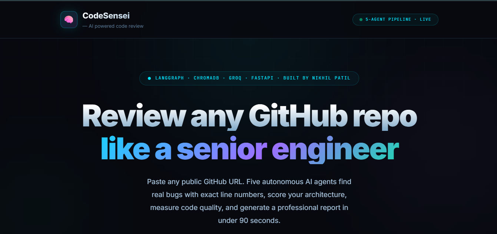
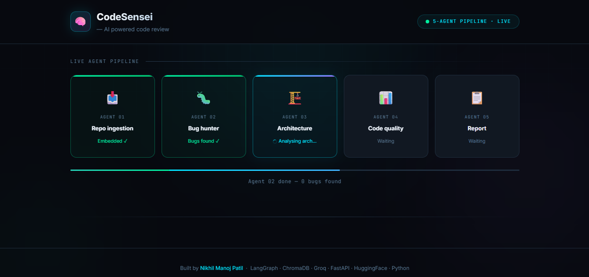
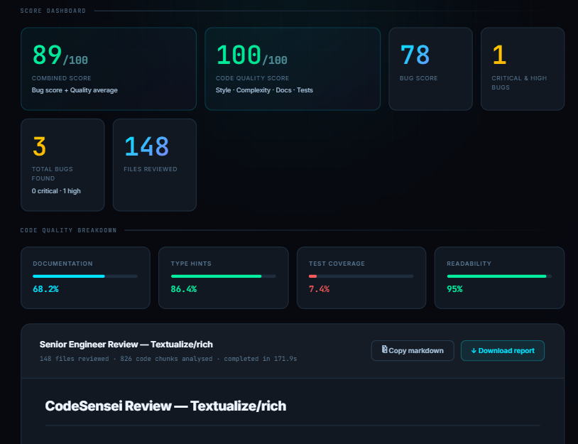
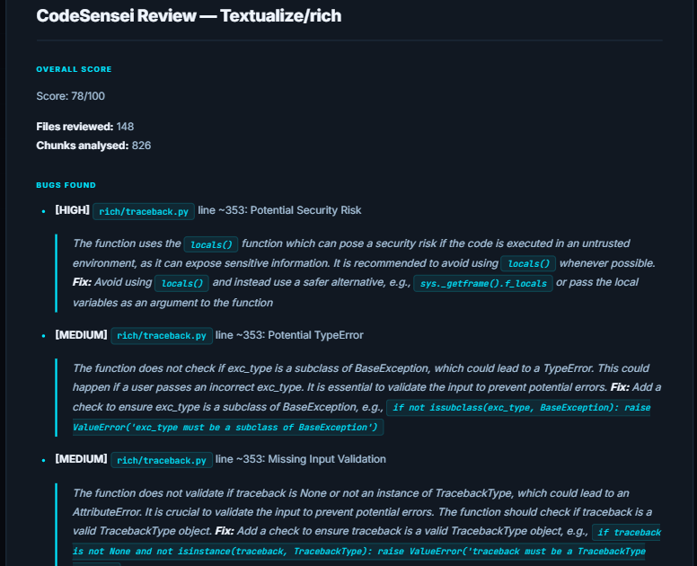
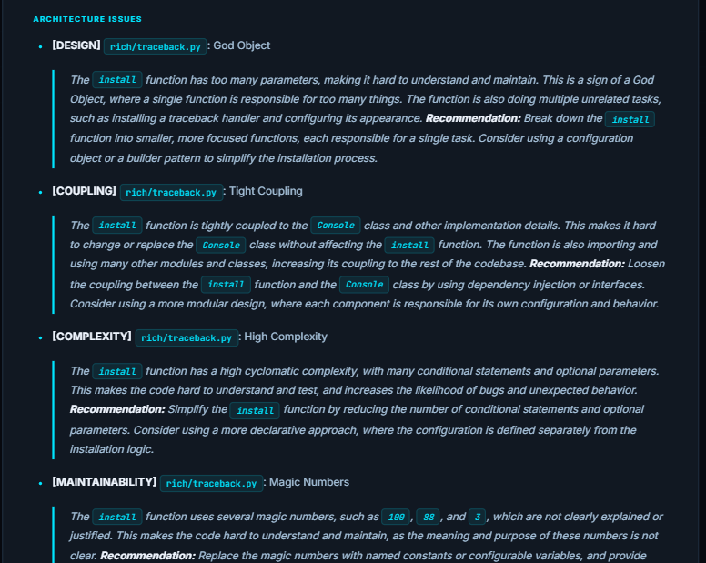

# 🧠 CodeSensei

> **Production-inspired Multi-Agent Repository Analysis System** that analyzes GitHub repositories using **LangGraph orchestration, Hybrid Retrieval (Semantic + Keyword Search), ChromaDB, and LLM reasoning** to detect bugs, evaluate architecture, measure code quality, and generate professional engineering reports with actionable recommendations.
> **Autonomous AI code review platform that uses multi-agent LLM workflows to analyze GitHub repositories, detect potential bugs, evaluate architecture, and generate engineering reports.

<p align="center">


</p>

---

## 🚀 Overview

CodeSensei is a production-inspired AI platform that performs repository-scale analysis through a collaborative team of autonomous AI agents.

Instead of relying on a single LLM prompt, CodeSensei indexes an entire repository into semantic embeddings, performs hybrid retrieval to identify the most relevant source code, and routes the retrieved context through specialized AI agents that independently analyze bugs, architecture, and code quality before producing a comprehensive engineering report.

This architecture enables repository-wide analysis while overcoming the context-window limitations of traditional LLM-based code review.

---

## ✨ Highlights

- 🤖 5 Autonomous AI Agents orchestrated with LangGraph
- 🔍 Hybrid Retrieval (Semantic + Keyword Search)
- 🧠 Repository-scale Retrieval-Augmented Generation (RAG)
- 🗄️ ChromaDB Vector Database
- 🐛 AI Bug Detection with file paths, line numbers and confidence scores
- 🏗️ Repository Architecture Analysis
- 📊 Automated Code Quality Evaluation
- ⚡ Live Multi-Agent Progress Tracking
- 📝 Professional Engineering Report Generation
- 🚀 FastAPI Asynchronous Backend
- 🐳 Dockerized Deployment
- ☁️ AWS EC2 Production Deployment

---

# 🚀 Deployment

CodeSensei is deployed as a production-inspired repository analysis platform using Docker Compose on AWS EC2.

### Production Stack

- ☁️ AWS EC2
- 🐳 Docker Compose
- ⚡ FastAPI Backend
- 🧠 LangGraph Multi-Agent Orchestration
- 🗄️ ChromaDB Vector Database
- 🤖 Groq Llama 3 70B
- 🔎 Hybrid Retrieval Engine
- 🎨 Vanilla HTML, CSS & JavaScript

> **Note**
>
> The application runs on an AWS EC2 free-tier instance. Since the public IP changes whenever the instance is restarted, a permanent deployment URL is not included in this repository.

---

## 🔄 Repository Analysis Pipeline

```text
Public GitHub Repository
         │
         ▼
Repository Ingestion
         │
         ▼
AST-Based Code Chunking
         │
         ▼
Embedding Generation
         │
         ▼
Hybrid Retrieval
(Semantic + Keyword Search)
         │
         ▼
LangGraph Multi-Agent Workflow
         │
         ▼
📥 Repository Agent
         │
         ▼
🐛 Bug Hunter Agent
         │
         ▼
🏗️ Architecture Agent
         │
         ▼
📊 Code Quality Agent
         │
         ▼
📝 Report Generation Agent
         │
         ▼
Live Progress Dashboard
         │
         ▼
Engineering Report
```
---

# 🎥 Demonstration

Watch CodeSensei perform an end-to-end AI-powered repository analysis.

<p align="center">
  <a href="https://github.com/NikhilPatil9263/codesensei/releases/download/v1.0/Demo_Codesensei.1.mp4">
    
  </a>
</p>

<p align="center">
  <b>▶️ Watch the 2-minute demonstration</b>
</p>

---

## 🏠 Landing Page

Submit any public GitHub repository and start a complete AI-powered engineering review.

<p align="center">
  
</p>

---

## ⚡ Live Multi-Agent Pipeline

Watch all five autonomous AI agents execute in real time as the repository progresses through the analysis pipeline.

Features shown:

- Repository ingestion
- Bug detection
- Architecture review
- Code quality analysis
- Engineering report generation



---

## 📊 Engineering Dashboard

Repository-wide engineering metrics including:

- Overall Score
- Bug Score
- Code Quality Score
- Documentation Coverage
- Type Hint Coverage
- Test Coverage
- Repository Statistics



---

## 🐛 AI Bug Detection

Every detected issue includes:

- Severity
- Confidence Score
- File Path
- Line Number
- Technical Explanation
- Suggested Fix



---

## 🏗️ Architecture Review

Repository-wide structural analysis highlighting:

- Tight Coupling
- Large Classes
- Duplicate Logic
- Maintainability Issues
- Refactoring Recommendations



---

## 📝 Engineering Report

Automatically generated engineering report containing:

- Executive Summary
- Repository Score
- Bug Summary
- Architecture Findings
- Code Quality Analysis
- Recommended Improvements


---

# ⭐ Why CodeSensei?

Traditional LLMs struggle to analyze large repositories because they are constrained by context windows. Even modern models cannot process hundreds of source files in a single prompt without losing important information.

CodeSensei solves this limitation through a **Multi-Agent Retrieval-Augmented Generation (RAG)** architecture.

Instead of sending an entire repository to the LLM, CodeSensei:

1. Clones the repository.
2. Parses source files into logical code chunks.
3. Generates semantic embeddings.
4. Stores embeddings in ChromaDB.
5. Performs Hybrid Retrieval (Semantic + Keyword Search).
6. Routes relevant context to specialized AI agents.
7. Aggregates findings into a professional engineering report.

This enables repository-scale reasoning while keeping every LLM call focused, efficient, and highly relevant.

---

# 📈 Performance

| Metric | Value |
|---------|------:|
| AI Agents | 5 |
| Languages Supported | 13+ |
| Largest Repository Tested | 148 Files |
| Code Chunks Indexed | 826+ |
| Retrieval Strategy | Hybrid (Semantic + Keyword) |
| Vector Database | ChromaDB |
| Embedding Model | sentence-transformers |
| LLM | Groq Llama 3 70B |
| Backend | FastAPI |
| Deployment | Docker Compose on AWS EC2 |

---

# 💡 Use Cases

- 🔍 Repository Health Analysis
- 🐛 AI-assisted Bug Detection
- 🏗️ Software Architecture Review
- 📊 Code Quality Assessment
- 👨‍💻 Developer Onboarding
- 📚 Open Source Repository Analysis
- 🚀 AI-powered Engineering Reviews
- 🎯 Portfolio Evaluation
- ---

# 🏛️ System Architecture

```text
                        Public GitHub Repository
                                  │
                                  ▼
                   ┌────────────────────────────┐
                   │ Repository Ingestion Agent │
                   │ GitHub API + AST Chunking  │
                   └──────────────┬─────────────┘
                                  │
                                  ▼
                   ┌────────────────────────────┐
                   │ Embedding Generation       │
                   │ sentence-transformers      │
                   └──────────────┬─────────────┘
                                  │
                                  ▼
                   ┌────────────────────────────┐
                   │ ChromaDB Vector Store      │
                   └──────────────┬─────────────┘
                                  │
                                  ▼
                   ┌────────────────────────────┐
                   │ Hybrid Retrieval Engine    │
                   │ Semantic + Keyword Search  │
                   └──────────────┬─────────────┘
                                  │
                                  ▼
                   ┌────────────────────────────┐
                   │ LangGraph StateGraph       │
                   └──────────────┬─────────────┘
                                  │
        ┌──────────────┬──────────┴──────────┬──────────────┐
        ▼              ▼                     ▼              ▼
Repository        Bug Hunter          Architecture     Code Quality
   Agent             Agent                Agent            Agent
        └──────────────┬──────────┬──────────┬──────────────┘
                       ▼
              Report Generation Agent
                       │
                       ▼
         Live Dashboard + Markdown Report
```

---

# 🤖 AI Agent Workflow

| Agent | Responsibility | Technologies |
|--------|----------------|--------------|
| 📥 Repository Ingestion | Downloads repository, chunks source code, generates embeddings, indexes into ChromaDB | GitHub API, AST, sentence-transformers, ChromaDB |
| 🐛 Bug Hunter | Detects bugs, identifies file paths and line numbers, assigns confidence scores | Hybrid Retrieval, LangChain, Groq |
| 🏗️ Architecture | Evaluates repository structure, coupling, complexity and maintainability | Hybrid Retrieval, Groq |
| 📊 Code Quality | Measures documentation, type hints, readability and test coverage | Python AST, Regex |
| 📝 Report Generator | Produces engineering report with executive summary and recommendations | LangGraph, Groq |

---

# ⚙️ Key Features

### 🤖 Multi-Agent Orchestration

Five autonomous AI agents collaborate using LangGraph to analyze repositories from multiple engineering perspectives.

---

### 🔍 Hybrid Retrieval

Combines

- Semantic Vector Search
- Keyword Matching

to retrieve highly relevant code snippets before every LLM call.

---

### 🧠 Repository-scale RAG

Entire repositories are indexed into ChromaDB, allowing CodeSensei to analyze projects much larger than any LLM context window.

---

### ⚡ Live Agent Progress

The frontend displays real-time execution status for every AI agent, providing visibility into long-running repository analysis.

---

### 📊 Engineering Metrics

Automatically computes

- Overall Repository Score
- Bug Score
- Code Quality Score
- Documentation Coverage
- Type Hint Coverage
- Test Coverage
- Readability Metrics

---

### 🎯 Confidence Scoring

Every detected issue includes an AI confidence score to help prioritize engineering effort.

---

### 📝 Professional Reports

Generates Markdown engineering reports with

- Executive Summary
- Repository Health
- Bug Analysis
- Architecture Findings
- Code Quality Assessment
- Actionable Recommendations

---

### 🚀 Production-oriented Backend

- FastAPI Async APIs
- Background Job Processing
- Rate Limiting
- Model Preloading
- Docker Compose Deployment
- AWS EC2 Hosting

---

# 📂 Project Structure

```text
codesensei/
│
├── backend/
│   ├── agents/
│   │   ├── ingestion.py
│   │   ├── bug_hunter.py
│   │   ├── architecture.py
│   │   ├── quality.py
│   │   ├── report.py
│   │   └── graph.py
│   │
│   ├── vectorstore/
│   │   ├── embed.py
│   │   ├── retrieval.py
│   │   └── store.py
│   │
│   ├── utils/
│   │   ├── chunker.py
│   │   └── github_fetcher.py
│   │
│   ├── main.py
│   └── requirements.txt
│
├── frontend/
│   └── index.html
│
├── assets/
│
├── docker-compose.yml
│
└── README.md
```

---

# 🛠️ Technology Stack

| Layer | Technology |
|--------|------------|
| Programming Language | Python |
| Backend | FastAPI |
| Agent Framework | LangGraph |
| LLM Framework | LangChain |
| Language Model | Groq Llama 3 70B |
| Embedding Model | sentence-transformers |
| Vector Database | ChromaDB |
| Retrieval | Hybrid Retrieval (Semantic + Keyword) |
| Code Parsing | Python AST |
| Frontend | HTML, CSS, JavaScript |
| Deployment | Docker Compose |
| Cloud | AWS EC2 |

---

# 🚀 Quick Start

## Requirements

- Python 3.10+
- Groq API Key
- GitHub Personal Access Token

### Clone Repository

```bash
git clone https://github.com/NikhilPatil9263/codesensei.git
cd codesensei/backend
```

### Create Virtual Environment

```bash
python -m venv venv
```

Windows

```bash
venv\Scripts\activate
```

Linux/macOS

```bash
source venv/bin/activate
```

### Install Dependencies

```bash
pip install -r requirements.txt
```

### Configure Environment

```env
GROQ_API_KEY=your_key
GITHUB_TOKEN=your_token
CHROMA_PERSIST_DIR=./chroma_db
```

### Run

```bash
uvicorn main:app --reload
```

Visit

```
http://localhost:8000
```

---

# 📡 API

### Start Repository Analysis

```http
POST /api/review
```

```json
{
"repo_url": "https://github.com/Textualize/rich"
}
```

---

### Get Analysis Status

```http
GET /api/status/{job_id}
```

---

### Health Check

```http
GET /api/health
```

---

# 🗺️ Roadmap

## Near-Term Improvements

- [ ] Real-time agent progress streaming via Server-Sent Events (SSE)
- [ ] Incremental repository indexing with embedding cache
- [ ] Redis-backed persistent job storage
- [ ] Semantic deduplication across agent outputs

## Longer-Term Improvements

- [ ] GitHub Pull Request review integration
- [ ] Multi-language AST chunking using Tree-sitter
- [ ] Private repository support through GitHub OAuth
- [ ] Historical repository quality tracking

---

# 🤝 Contributing

Contributions, feature requests, and bug reports are welcome.

Please open an issue or submit a pull request.

---

# 📜 License

Released under the MIT License.

---

# 👨‍💻 Author

**Nikhil Manoj Patil**

AI/ML Engineer | Agentic AI | LLM Applications | Computer Vision | FastAPI | LangGraph

- 📧 nikhilpatil9263@gmail.com
- 💼 LinkedIn
- 🐙 GitHub: https://github.com/NikhilPatil9263

---

⭐ If you found CodeSensei useful, consider giving the repository a star.
